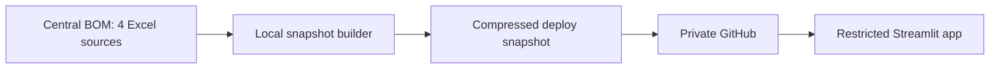

# Architecture and source boundaries

## Boundary decisions

- BOM remains the governed source location.
- The app consumes Current Inventory, Product COGS, Product Master and SCM Actual vs. Forecast.
- Product Status Mapping Master is outside this application's boundary.
- Snapshot creation performs all expensive workbook parsing and joins.
- Streamlit loads one compressed file and caches it by filename, size and modified timestamp.
- Raw BOM files are not committed to GitHub.
- The deploy snapshot is still confidential and requires private/restricted access.

## Refresh modes

| Mode | Intended use | Startup behavior |
|---|---|---|
| Fast deploy snapshot | Hosted app and normal local use | Reads `inventory_snapshot.csv.gz` |
| Direct Excel | Refresh/build and troubleshooting | Reads and enriches four BOM workbooks |

Set environment variable `SKU_FORCE_EXCEL=1` only when testing direct Excel files placed in the
selected data directory. Normal users should run the snapshot builder instead.
